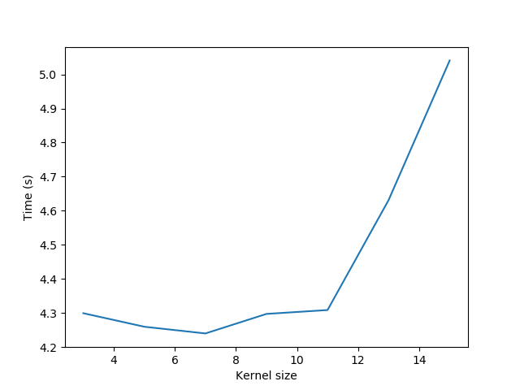

# CSE 398/498. Assignment 1
#### Student Name: Alibek Kaliyev
#### Email: alk224@lehigh.edu

## Installation
1. Create an environment from ```environment.yml``` file:
```
conda env create -f environment.yml
```

2. Activate the environment:
```
conda activate cse398_alk224
```

3. Verify that the environment was installed correctly:
```
conda env list
```

## Usage
Each of the following commands should be run from the ```src/``` directory of the project. Run the following command in your terminal to move there:
```
cd src
```

### Task 1
To run the task 1, run the following command:
```
python task1.py
```

Wait for the program to finish running. The output will be saved in the ```output/task1/``` directory. After the image is displayed, press ```Enter```on your keyboard to move further.

### Task 2
To run the task 2, run the following command:

```
python task2.py
```

Wait for the program to finish running. The output will be saved in the ```output/task2/``` directory. After the image is displayed, press ```Enter```on your keyboard to move further.

You can also run the analysis part of the task 2 by running the following command:
```
python task2_analysis.py
```
The output plot will be saved in the ```output/task2/``` directory under the name ```plot.png```.

#### Analysis

##### Suitable filtering method
- **Mean filter**: works fairly well, but blurs the image too much. Also, it did not remove the noise from salt and pepper noise on the moon. In my understanding, it is because the mean filter takes the average of the pixels around the current pixel, and the pixels around the current pixel are also noisy. So, the mean filter will not be able to remove the noise.
- **Gaussian filter**: works well for the gaussian noise, but does not remove the noise from salt and pepper noise well. In my understanding, it is because the gaussian filter does the reverse process of the gaussian noise generation.
- **Median filter**: works well for both gaussian noise and salt-and-pepper noise. It preserves details about the edges, but loses some of the detailed information. It also does not blur the image too much. In my own understanding, it works well because it removes outliers from the image, which are the noise in this case.

##### Kernel size vs. Computation Time


With an increase in the kernel/filter size, the time to complete a convolution increases. This is because the convolution operation is performed on a larger number of pixels.

The analysis was performed on ```gb_image1.jpg``` and tested with ```mean filter```. The results are shown in the plot above.

### Task 3
To run the task 3, run the following command:

```
python task3.py
```

Wait for the program to finish running. The output will be saved in the ```output/task3/``` directory. After the image is displayed, press ```Enter```on your keyboard to move further.

### References
- [1] http://www.adeveloperdiary.com/data-science/computer-vision/applying-gaussian-smoothing-to-an-image-using-python-from-scratch/